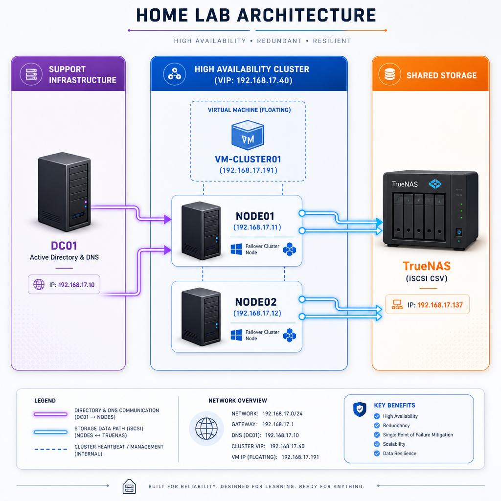
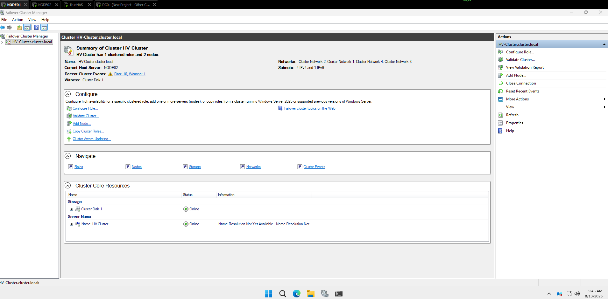
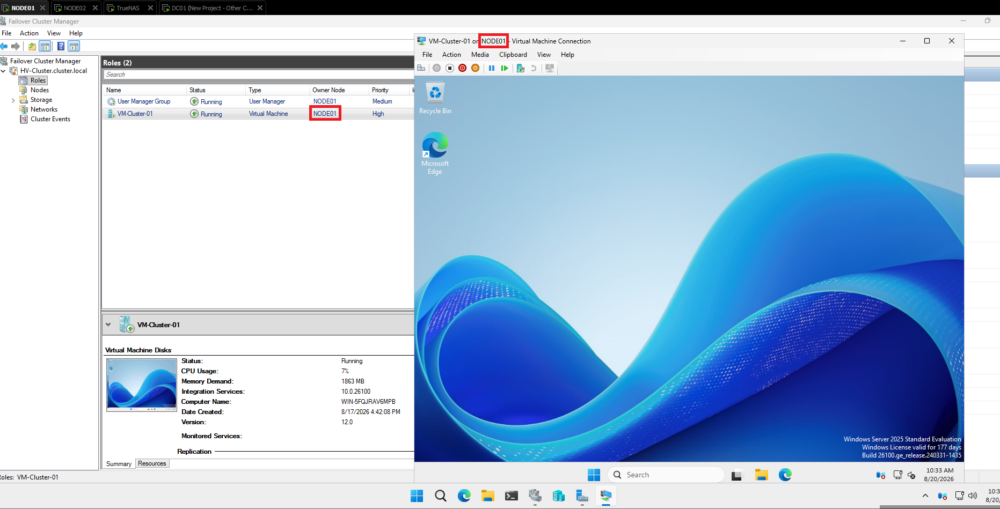
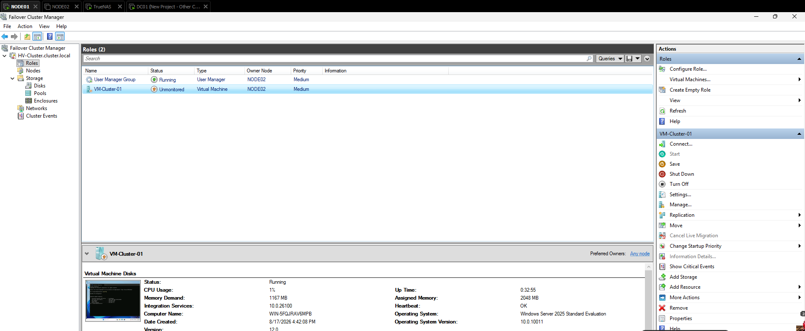
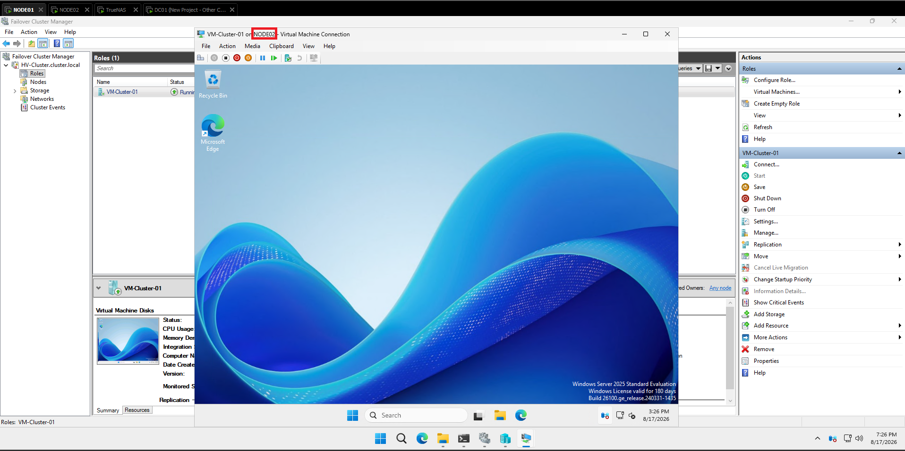
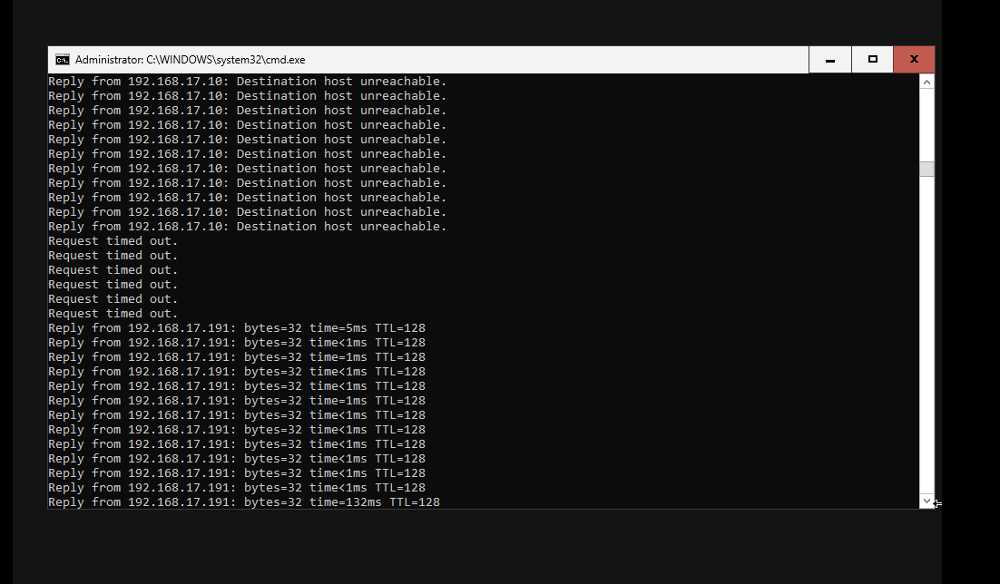

# High Availability Lab: Windows Server Hyper-V Cluster

*(Para a versão em Português, leia o [README-PT.md](README-PT.md))*

  

## 🎯 Project Objective
This laboratory simulates a mission-critical corporate environment. The goal was to configure a High Availability (HA) Cluster using Microsoft Hyper-V and a shared storage solution via TrueNAS. The architecture ensures that virtual machines remain operational and migrate automatically (via Failover and Live Migration) in the event of a hardware failure on one of the hosts.

## 💻 Lab Environment & Hardware
To support the heavy virtualization load of the entire infrastructure, the lab had to be migrated from a standard laptop to a main workstation with higher processing and I/O capabilities.

The environment ran smoothly on the following hardware setup:
* **CPU:** AMD Ryzen 7 5700X3D
* **Motherboard:** ASUS TUF Gaming B550M
* **GPU:** NVIDIA RTX 2070 Super
* **Storage:** Strategic virtual disk distribution utilizing 1 NVMe drive (for OS IOPS performance) and 4 SATA HDDs (for mass storage simulation).

## 🏗️ Topology and IP Addressing (192.168.17.0/24 Subnet)
* **DC01 (Domain Controller):** 192.168.17.10
* **NODE01 (Hyper-V Host 1):** 192.168.17.11
* **NODE02 (Hyper-V Host 2):** 192.168.17.12
* **TrueNAS (Virtual Storage):** 192.168.17.137
* **CLUSTER (Virtual IP):** 192.168.17.40
* **VM-CLUSTER01 (HA Virtual Machine):** 192.168.17.191

## 🚀 Results and Validation

**1. Cluster and Storage Online**
The Failover Cluster Manager successfully recognizing the nodes and shared disks.

**2. Normal State (VM on NODE01)**
The virtual machine operating and accessible through the primary host (`NODE01`).

**3. Failure Simulation and Transition**
Upon simulating the failure of NODE01, the cluster takes control (*Unmonitored* status) and initiates the failover to the secondary host.

**4. High Availability Achieved (VM on NODE02)**
The virtual machine automatically resumes operations on NODE02, ensuring service continuity.

**5. Connectivity Validation (Minimal Downtime)**
The ping test on the VM confirms a very brief interruption (loss of a few packets) before full service restoration during the failover process.
